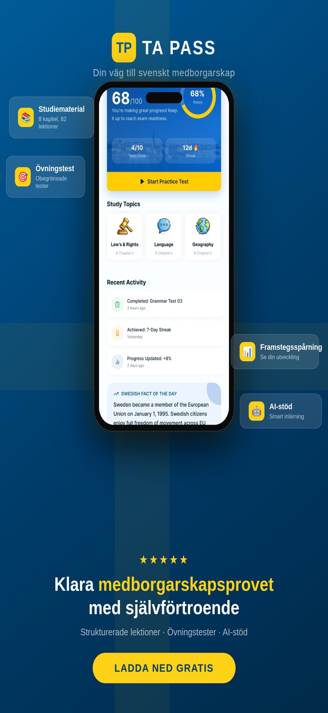
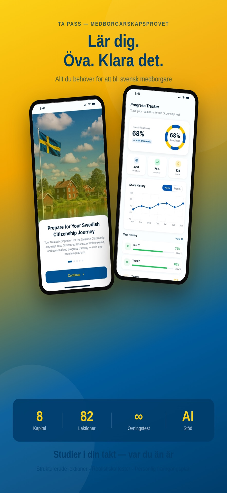
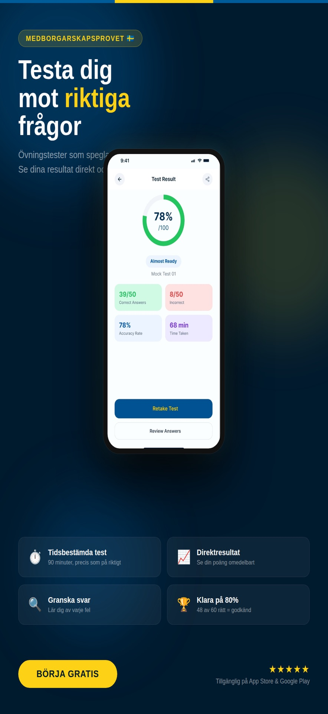

<p align="center">
  
</p>

<h1 align="center">TA-PASS</h1>

<p align="center">
  Swedish citizenship language test preparation for iOS and Android.
</p>

<p align="center">
  <a href="https://apps.apple.com/us/app/ta-pass-swedish-citizenship/id6799644651"></a>
  
  
</p>

<p align="center">
  
  
  
</p>

---

## Overview

TA-PASS is a mobile client for the Swedish citizenship language test. Candidates study chapter-based lessons, sit timed mock exams, review answers, and track readiness over time. The UI is localized in **English** and **Swedish**. Curriculum, scores, and progress live on a REST API; the app handles auth, navigation, store purchases, and presentation.

Store listings:

| Platform | Status | Link |
| --- | --- | --- |
| iOS | Live | [TA-PASS — Swedish Citizenship](https://apps.apple.com/us/app/ta-pass-swedish-citizenship/id6799644651) |
| Android | Internal testing | [Play Console internal test](https://play.google.com/apps/internaltest/4701490226041425689) |

| | |
| --- | --- |
| iOS bundle | `com.tapass.tapassapp` |
| Android application id | `com.tapass.tapass` |
| Client version | `1.0.7+7` (`pubspec.yaml`) |

---

## Features

- **Onboarding & splash** — first-run intro, then session restore
- **Auth** — email + OTP, Google Sign-In (iOS & Android), Sign in with Apple (iOS)
- **Home** — readiness score, streak, study shortcuts
- **Study** — chapters and lessons with server-side completion
- **Practice tests** — timed attempts, results, answer review
- **Progress** — overview, test history, score charts
- **Profile** — language, FAQ, legal links, account deletion
- **Premium** — RevenueCat subscriptions (`Tapass Pro`); free users get a limited preview
- **Push** — FCM token registered with the backend after login

---

## Architecture

Feature-first folders with a presentation / domain / data split:

```
lib/
├── main.dart
├── config/                 # routes, GetX pages, bindings
├── core/                   # network, storage, theme, localization, IAP
├── features/
│   ├── auth/
│   ├── home/
│   ├── study/
│   ├── test/
│   ├── progress/
│   ├── profile/
│   ├── subscription/
│   ├── notification/
│   ├── onboarding/
│   └── splash/
└── shared/                 # reusable widgets
```

Each feature:

| Layer | Responsibility |
| --- | --- |
| `presentation/` | Pages, GetX controllers, bindings |
| `domain/` | Repository contracts |
| `data/` | Dio datasources, models, repository implementations |

GetX owns routing, DI, and reactive UI. Dio + interceptors talk to the API. Tokens go in `flutter_secure_storage`; locale and onboarding flags use `shared_preferences`.

---

## Stack

| Area | Choice |
| --- | --- |
| UI | Flutter, Material 3 |
| State & navigation | GetX |
| HTTP | Dio |
| Config | `flutter_dotenv` |
| Auth (native) | `google_sign_in`, `sign_in_with_apple` |
| Push | Firebase Messaging, local notifications |
| IAP | RevenueCat (`purchases_flutter`) |
| Charts / media | `fl_chart`, `cached_network_image`, `image_picker` |
| i18n | GetX translations (`en_US`, `sv_SE`) |

Firebase is used for FCM, not as the session backend. App sessions are issued by the TA-PASS API.

---

## Getting started

**Requirements:** Flutter (Dart 3), Xcode and/or Android SDK, a local `.env` (gitignored).

```bash
flutter pub get
cd ios && pod install && cd ..
flutter run
```

Create `.env` in the project root (do not commit secrets):

```
API_BASE_URL=
REVENUECAT_IOS_API_KEY=
REVENUECAT_ANDROID_API_KEY=
GOOGLE_IOS_CLIENT_ID=
GOOGLE_ANDROID_CLIENT_ID=
GOOGLE_WEB_CLIENT_ID=
```

`GOOGLE_WEB_CLIENT_ID` is the OAuth **Web** client. Android needs it as `serverClientId` so Google returns an ID token.

```bash
flutter analyze
flutter build ios
flutter build appbundle
```

---

## License

Proprietary. All rights reserved.
